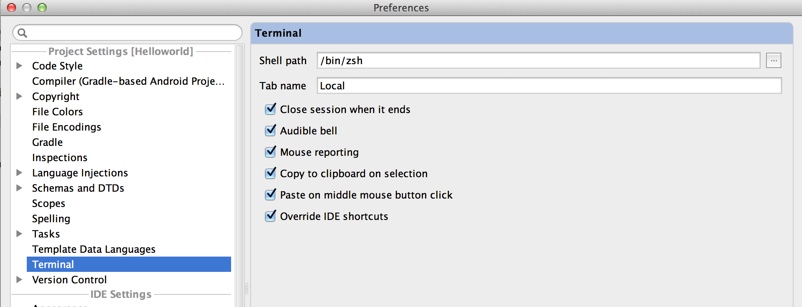

## Keymap

常用快捷键

常用快捷键

1.Ctrl+E，可以显示最近编辑的文件列表

2.Shift+Click可以关闭文件

3.Ctrl+[或]可以跳到大括号的开头结尾

4.Ctrl+Shift+Backspace可以跳转到上次编辑的地方

5.Ctrl+F12，可以显示当前文件的结构

6.Ctrl+F7可以查询当前元素在当前文件中的引用，然后按F3可以选择

7.Ctrl+N，可以快速打开类

8.Ctrl+Shift+N，可以快速打开文件

9.Alt+Q可以看到当前方法的声明

10.Ctrl+W可以选择单词继而语句继而行继而函数

11.Alt+F1可以将正在编辑的元素在各个面板中定位

12.Ctrl+P，可以显示参数信息

13.Ctrl+Shift+Insert可以选择剪贴板内容并插入

14.Alt+Insert可以生成构造器/Getter/Setter等

15.Ctrl+Alt+V 可以引入变量。例如把括号内的SQL赋成一个变量

16.Ctrl+Alt+T可以把代码包在一块内，例如try/catch

17.Alt+Up and Alt+Down可在方法间快速移动


----不常用快捷键

18.在一些地方按Alt+Enter可以得到一些Intention Action，例如将”==”改为”equals()”

19.Ctrl+Shift+Alt+N可以快速打开符号

20.Ctrl+Shift+Space在很多时候都能够给出Smart提示

21.Alt+F3可以快速寻找

22.Ctrl+/和Ctrl+Shift+/可以注释代码

23.Ctrl+Alt+B可以跳转到抽象方法的实现

24.Ctrl+O可以选择父类的方法进行重写

25.Ctrl+Q可以看JavaDoc

26.Ctrl+Alt+Space是类名自动完成

27.快速打开类/文件/符号时，可以使用通配符，也可以使用缩写

28.Live Templates! Ctrl+J

29.Ctrl+Shift+F7可以高亮当前元素在当前文件中的使用

30.Ctrl+Alt+Up /Ctrl+Alt+Down可以快速跳转搜索结果

31.Ctrl+Shift+J可以整合两行

32.Alt+F8是计算变量值


## terminal终端


### 终端设置

它会默认使用系统的shell，比如我的zsh，如下图




### 在terminal调用adb

```
source /etc/profile  
adb --help
```

示例如下图


### 快捷键

- `ctrl + l` 清空已有内容


## Active Editor

### 显示行号

```
View -> Active Editor -> Show Line Numbers
```


adb

zygote 受精卵


饭否开源了


http://romannurik.github.io/AndroidAssetStudio/index.html